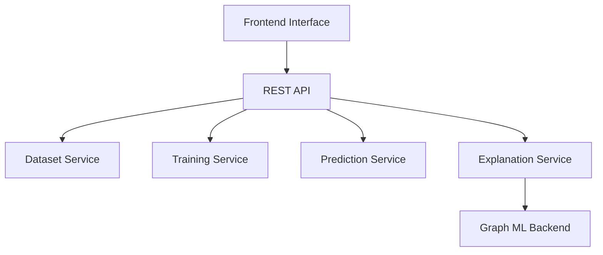

# ARIEN — Suspicious Node Detection Tool


ARIEN is an interactive graph machine learning platform for detecting suspicious nodes in graph-structured data.
The tool supports supervised and unsupervised anomaly detection, graph neural network model selection, node embeddings, GraphSMOTE, interactive graph visualization, manual annotation, and explainable AI workflows.


---
ARIEN is designed for suspicious entity detection in complex graph datasets such as communication networks, transaction graphs, investigation datasets, and relationship-based data. The platform enables users to:
- Upload graph data in JSON format
- Select graph machine learning models
- Configure model parameters
- Train supervised GNN models
- Run unsupervised anomaly detection
- Visualize suspicious nodes directly on a graph
- Adjust suspicion scores manually
- Search and inspect graph entities
- Explain model predictions using node, edge, and feature importance
- Export updated graph data and suspicious-node subsets

Video Demonstration: [Demo](https://www.youtube.com/watch?v=6RsYCFfSZsk)

---
## Why Graph-Based Suspicious Node Detection?
Suspicious behavior is often not visible from isolated records alone. It usually appears through relationships, communication patterns, transaction paths, or structural anomalies.
Graph-based machine learning allows the system to detect suspicious entities by analyzing:
- Node attributes
- Neighboring nodes
- Relationship types
- Graph structure
- Message or transaction context
- Learned node embeddings
  
Example of JSON
```json
{
  "relationships": [
    {
      "start": 0,
      "end": 1,
      "type": "SEND",
      "properties": {
        "name": "send0"
      }
    }
  ],
  "nodes": [
    {
      "id": 0,
      "properties": {
        "name": "B0007",
        "description": "Example person node",
        "label": 1
      },
      "labels": ["Pid"]
    }
  ]
}
````
---

## Platform Workflow
1. Choose Data


2. Choose Model
- Supervised learning mode requires a labeled dataset and label attribute (e.g., "label", "is_suspicious", etc.)
- Unsupervised learning mode does not require labeled data. The system detects anomalies automatically.


3. List of Trained Models


4. List of Completed Predictions


5. Suspicious Node Visualization
By clicking Run Predictions, users can visualize predictions on graph.


6. Explain Prediction
- Available only for predictions generated by supervised methods.
- For selected nodes, the platform can display: Node, Edge, and Feature importance


7. Manual Suspicious Node Annotation
Users can manually inspect and update suspicious nodes.


Example of prediction result using Unsupervised learning:


---
## Architecture



---

## Technologies

| Area             | Technologies                                         |
| ---------------- | ---------------------------------------------------- |
| Frontend         | HTML, CSS, JavaScript                                |
| UI               | Bootstrap, Bootstrap Icons, Material Symbols         |
| Visualization    | D3.js                                                |
| Data Format      | JSON Graph Data                                      |
| AI / ML Concepts | GNNs, Node Embeddings, GraphSMOTE, Anomaly Detection |
| Explainability   | Node Importance, Edge Importance, Feature Importance |
| State Management | Local Storage, Session Storage                       |
| Integration      | REST API                                             |

---

## My Contributions

* Developed frontend workflows for suspicious node detection
* Implemented dataset upload, selection, and deletion functionality
* Built model selection and parameter configuration interfaces
* Added support for supervised and unsupervised learning modes
* Developed D3.js graph visualization components
* Implemented node search, highlighting, and detail panels
* Added suspicious-node annotation and score editing workflows
* Implemented suspicious-node threshold filtering
* Integrated prediction result visualization
* Built export functionality for updated graph data and suspicious nodes
* Added explainability visualization for node, edge, and feature importance

---
## Security & Confidentiality Note
This repository is a public showcase of selected concepts, user interface components, and technical approaches.
The original project may include internal research, backend services, or protected implementation details that are not publicly shared due to confidentiality and project restrictions.

